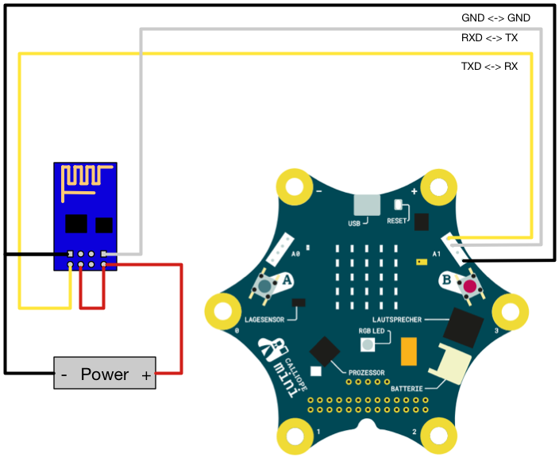
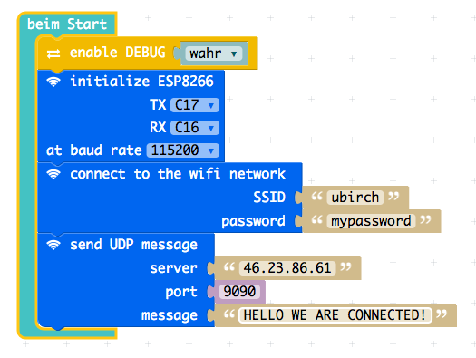

# Calliope mini ESP8622 Wifi Module

This is a package for controlling an ESP8622 module to send messages from the Calliope mini.
It can be used by the [PXT Calliope mini editor](https://pxt.calliope.cc/). Should also work
with PXT for Micro:bit.

> ⚠ The ESP8266 will need an **external power supply** capable of providing up to 300mA. If you try
> to directly use it with the Calliope mini, it will not connect and the Calliope mini resets
> due to too much power drawn.

> **Update Firmware!** You may want to update the ESP with the latest firmware. The add-on requires at least v2.0 of the 
> AT command firmeware. You can find the firmware download link here: 
> [http://www.electrodragon.com/w/ESP8266_AT-Command_firmware](http://www.electrodragon.com/w/ESP8266_AT-Command_firmware) 
> under Espressif AT Commands Firmware.

## Wiring the module



## Testing

- Modify `tests.ts` to send packages to your own server.
- Execute two little servers: `while(true); do nc -l -p 9090; sleep 1; done` and `nc -l -u -p 9091` (Linux, also echos the messages) 
- Compile the test `pxt test` and copy `built/binary.hex` to the Calliope mini.

On the USB console window you will see this:

```
TEST START
TEST: modem working: OK
TEST: disable echo: OK
TEST: modem identification: OK
TEST: AT version:1.3.0.0: OK
TEST: SDK version:2.0.0: OK
TEST: wifi set mode: OK
TEST: wifi mode: OK
TEST: wifi connect: OK
TEST: ip mode: OK
TEST: ip connect: OK
>>> (1)  
>>> (13) Recv 15 bytes
>>> (7) SEND OK
TEST: ip status: OK
TEST: ip close: OK
TEST: wifi disconnect: OK
TEST: network not found: OK
TEST: network attach: OK
TEST: TCP send: OK
TEST: UDP send: OK
TEST: network detached: OK
TEST: network attach: OK
TEST: message send: OK
TEST: network detached: OK
TEST FINISHED OK
```

> You can follow the AT flow on the USB serial console by enabling debug in `tests.ts`

The server should show something like this:

```
while(true); do nc -l -p 9090; sleep 1; done                   
{"test":123456}{"test":123456}
```

## Example

### Blocks


### Javascript

```typescript
modem.enableDebug(true)
esp8266.init(
    SerialPin.C17,
    SerialPin.C16,
    BaudRate.BaudRate115200
)
esp8266.attach(
    "ubirch",
    "mypassword"
)
esp8266.send(
    MessageType.TCP,
    "46.23.86.61",
    9090,
    "HELLO WE ARE CONNECTED!"
)
```

## Meta

- PXT/calliope
- PXT/microbit

Depends on [pxt-calliope-modem](https://github.com/calliope-mini/pxt-calliope-modem).

Author: Matthias L. Jugel ([@thinkberg](https://twitter.com/thinkberg))

## License

MIT